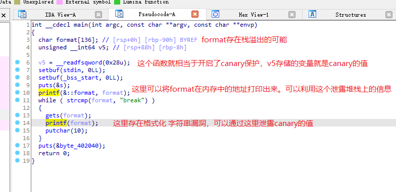
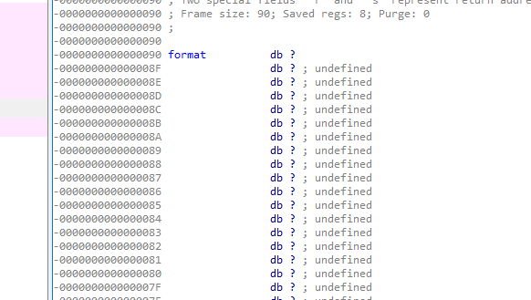
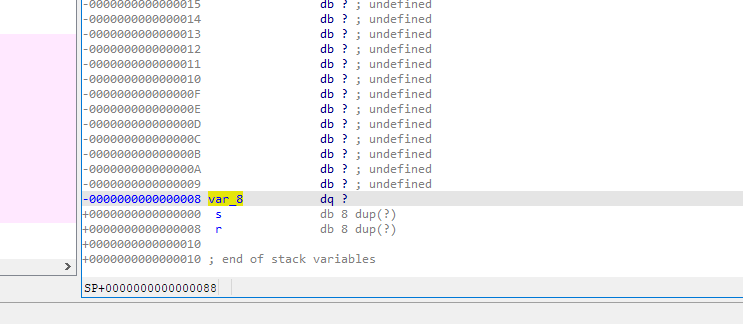
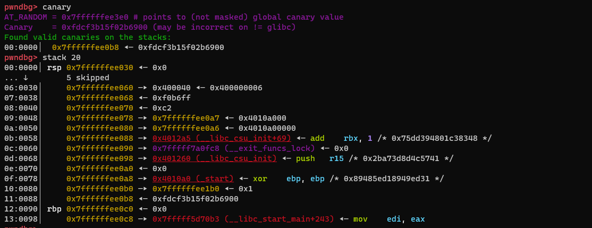

## ret2shellcode

### 绕过canary保护

- 通过**格式化字符串漏洞**绕过canary的值

**格式化字符串**

由于函数参数通过栈进行传递，因此使用`%X$p`(X为任意正整数)可以泄露栈上的数据，并且，在能对栈上的数据进行控制的情况下，可以事先将想泄露的地址写在栈上，再使用上述语句就可以以字符串格式输出想泄露的地址。

1. 使用ida进行调试

进入到使用canary的函数的堆栈中，查看canary和存在栈溢出变量之间的距离



查看堆栈信息

这是format距离基址寄存器rbp的位置:`+90h`



这里的var_8就是我们想要获取的canary的地址,距离rbp:`+08h`



与format的偏移为： `0x90-0x8=0x88`

十六进制0x88转换为十进制是136，也就是相差136个字节，在64位程序中，指针长度为8个字节，136/8=17，这是相差的变量的个数.


在64位程序中，传递参数的寄存器顺序变成了`RDI,RSI,RDX,R10,R8,R9`，所以我们如果想泄露canary的内容，还需要加上这6个寄存器，即第23个变量的值就是我们想要的canary的值
   


2. 使用pwndbg进行调试

- 安装pwndbg出现报错`fatal: Not a git repository (or any parent up to mount point /export) Stopping at filesystem boundary (GIT_DISCOVERY_ACROSS_FILESYSTEM not set)`
- 解决办法：`git init`


开始调试： `gdb [程序名称]`

下断点`b printf`

然后开始运行程序`start`

然后运行几次 `s` 

再输入`canary`查看canary的值

再输入`stack 20` 查看目前栈上20行的内容



可以看到0x7ffffffee0b8 和rsp的距离是0x88,

```asm
pwndbg> stack 20
00:0000│ rsp 0x7ffffffee030 ◂— 0x0
... ↓        5 skipped
06:0030│     0x7ffffffee060 —▸ 0x400040 ◂— 0x400000006
07:0038│     0x7ffffffee068 ◂— 0xf0b6ff
08:0040│     0x7ffffffee070 ◂— 0xc2
09:0048│     0x7ffffffee078 —▸ 0x7ffffffee0a7 ◂— 0x4010a000
0a:0050│     0x7ffffffee080 —▸ 0x7ffffffee0a6 ◂— 0x4010a00000
0b:0058│     0x7ffffffee088 —▸ 0x4012a5 (__libc_csu_init+69) ◂— add    rbx, 1 /* 0x75dd394801c38348 */
0c:0060│     0x7ffffffee090 —▸ 0x7fffff7a0fc8 (__exit_funcs_lock) ◂— 0x0
0d:0068│     0x7ffffffee098 —▸ 0x401260 (__libc_csu_init) ◂— push   r15 /* 0x2ba73d8d4c5741 */
0e:0070│     0x7ffffffee0a0 ◂— 0x0
0f:0078│     0x7ffffffee0a8 —▸ 0x4010a0 (_start) ◂— xor    ebp, ebp /* 0x89485ed18949ed31 */
10:0080│     0x7ffffffee0b0 —▸ 0x7ffffffee1b0 ◂— 0x1
11:0088│     0x7ffffffee0b8 ◂— 0xfdcf3b15f02b6900
12:0090│ rbp 0x7ffffffee0c0 ◂— 0x0
13:0098│     0x7ffffffee0c8 —▸ 0x7fffff5d70b3 (__libc_start_main+243) ◂— mov    edi, eax
```

和ida的思路一样

第23个参数的位置就是我们要的canary的位置

输入`%23$p`就可以获得


## 一些gdb 常见命令

```
-q 参数不显示欢迎信息等

-n 不加载任何插件，使用原生 gdb

info 后面跟上想要查看的信息，如函数信息 info functions

b/breakpoint 设置断点

del/delete breakpoints n 删除断点，n是断点编号，可用info breakpoints命令查看断点信息

start 命令启动程序并停在开辟完主函数栈帧的地方

c/continue 继续执行程序，遇到断点停下

f/finish 结束程序

r/run 运行程序，遇到断点停下

ni 单步步过，一步一步执行指令遇到函数调用时直接执行完整个函数

si 单步步入，一步一步执行指令遇到函数调用时跳转到函数内部

vmmap 查看内存映射

checksec 查看程序的防护措施

pdisass/disassemble 查看当前函数帧的反汇编代码，前一个命令有高亮显示只是需要安装pwndbg插件，后面一个命令时gdb自带的命令无高亮显示

p/print 打印信息，如寄存器 p $ebp

x/<n/f/u> <addr> 查看某地址处的值，n/f/u 参数为可选，n代表想要查看多少个内存单元即从当前地址开始计算，每个内存单元的大小由后面的u参数指定；f表示显示格式，如s表示字符串形式，i为指令形式；u指定内存单元大小，b(一个字节)、h(双字节)、w(四个字节)、g(八字节)默认为w；        后面跟上x代表以十六进制的形式查看变量 

set *addr = value 设置某个地址的值

```


cyclic 命令可以打印出类似四字节一循环的字符串，返回地址被这些值覆盖后程序运行就会报无效地址错误。用gdb调式程序，输入 r 运行程序，停在输入处输入cyclic字符串，查看无效地址


通过cyclic -l addr 命令可以得到返回地址与缓冲区的偏移
```
cyclic -l 0x6261616b
```
